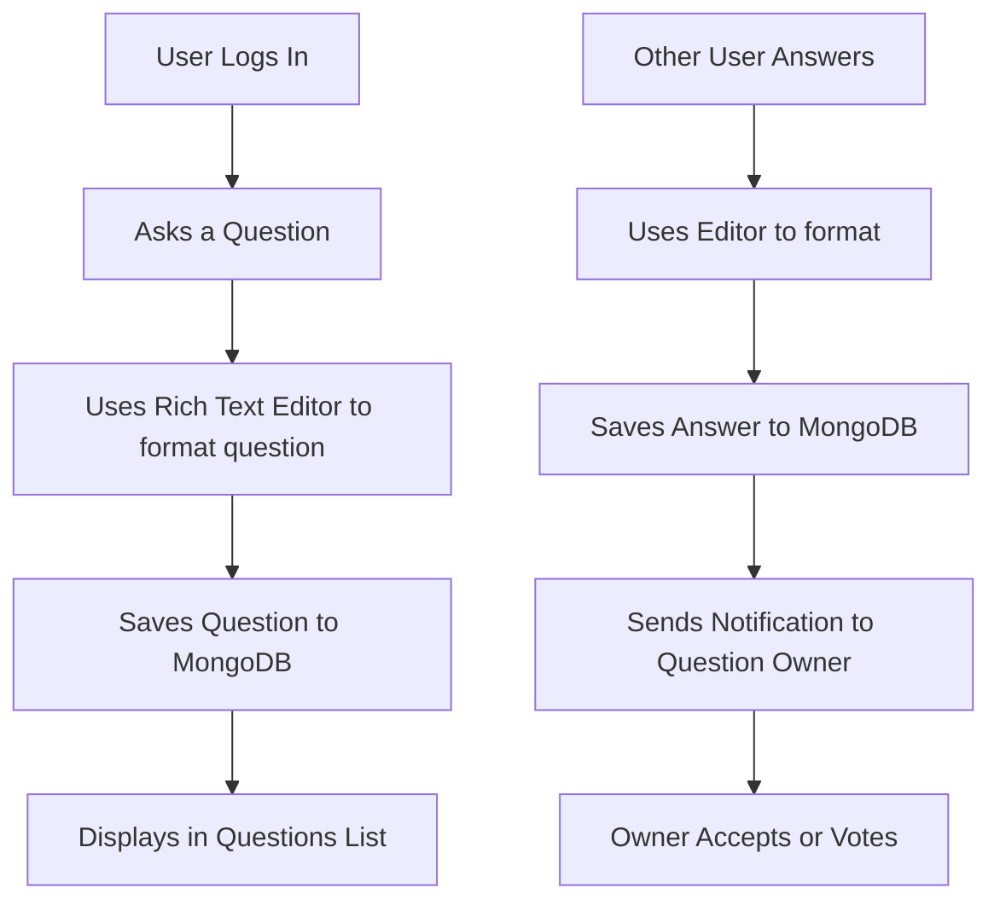

# StackIt  – A Minimal Q&A Forum Platform

**StackIt is a minimal question-and-answer platform that supports collaborative 
learning and structured knowledge sharing. It’s designed to be simple, user-friendly, 
and focused on the core experience of asking and answering questions within a 
community.**

[](https://reactjs.org/)
[](https://tailwindcss.com/)
[](https://www.typescriptlang.org/)
[](https://python.org/)
[](https://flask.palletsprojects.com/)


Get required answers, conceptual clarity using a modern, responsive web interface powered by intelligent filtering and clean UI.

---

## StackIt Screenshots

| Home Page | Ask a Question | All Questions |
|-----------|----------------|----------------|
|  |  |  |




## Quick Start


### Prerequisites

- **Node.js** 16.x or higher
- **Python** 3.8 or higher
- **npm**  package manager
- **FastAPI** Latest Version

### Installation

1. **Clone the repository**
   ```bash
   git clone https://github.com/yourusername/StackIt.git
   cd movierecom
   ```

2. **Setup Backend**
   ```bash
   cd backend
   python -m venv venv
   
   # Windows
   venv\Scripts\activate
   
   # macOS/Linux
   source venv/bin/activate
   
   pip install -r requirements.txt
   ```

3. **Setup Frontend**
   ```bash
   cd ../  # Return to root directory
   npm install
   ```
4. **Start the Application**
   
   **Terminal 1 - Backend:**
   ```bash
   cd backend
   python app.py
   ```
   
   **Terminal 2 - Frontend:**
   ```bash
   npm run dev
   ```

5. **Access the Application**
   - Frontend: `http://localhost:5173`
   - Backend API: `http://localhost:5000`

## Project Structure

## Project Structure

```
StackIt/
├── backend/
│   ├── app.py
│   ├── requirements.txt
│   ├── models/
│   ├── routes/
│   └── ... (other backend files)
├── public/
│   └── ... (static assets, favicon, etc.)
├── src/
│   ├── components/
│   │   ├── ui/
│   │   └── ... (shared and UI components)
│   ├── pages/
│   │   ├── Home.tsx
│   │   ├── Questions.tsx
│   │   ├── Tags.tsx
│   │   ├── User.tsx
│   │   └── ... (other pages)
│   ├── App.tsx
│   ├── main.tsx
│   └── ... (frontend logic)
├── .env
├── package.json
├── tailwind.config.js
├── tsconfig.json
└── README.md
```
- **backend/**: Python Flask/FastAPI backend code, models, and API routes.
- **public/**: Static assets for the frontend.
- **src/components/**: Reusable React components and UI elements.
- **src/pages/**: Main route pages for the app.
- **App.tsx / main.tsx**: React entry points.
- **.env**: Environment variables.
- **package.json**: Frontend dependencies and scripts.
- **tailwind.config.js**: Tailwind CSS configuration.


